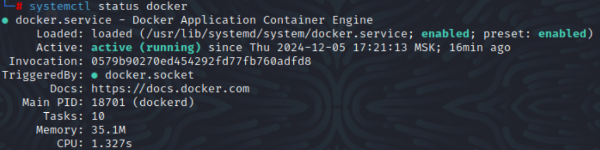
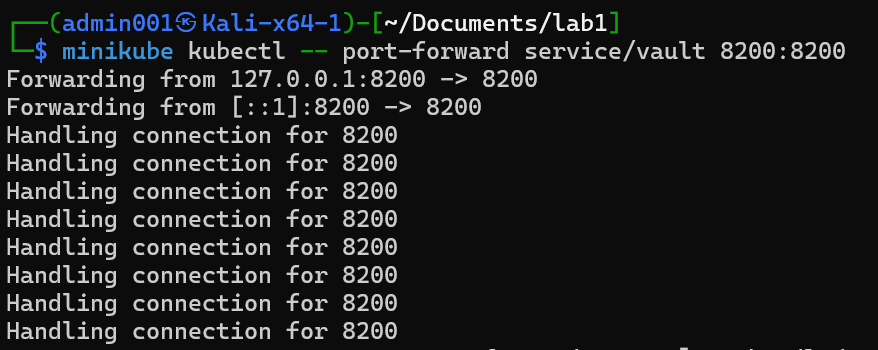
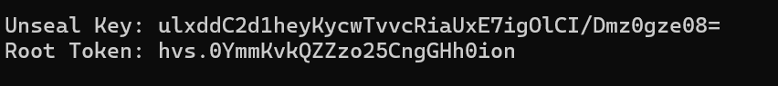
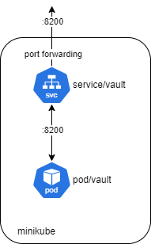

University: [ITMO University](https://itmo.ru/ru/)
Faculty: [FICT](https://fict.itmo.ru)
Course: [Introduction to distributed technologies](https://github.com/itmo-ict-faculty/introduction-to-distributed-technologies)
Year: 2024/2025
Group: K4110c
Author: Zagvozkin Artem Pavlovich
Lab: Lab1
Date of create: 04.12.2024
Date of finished: 


# Ход работы
### 1. Установка Docker и Minikube
Установливаем Docker
```bash
apt update
apt install docker.io
docker version
```

```bash
systemctl enable docker --now
systemctl status docker
```



Установливаем Minikube
```bash
curl -LO https://storage.googleapis.com/minikube/releases/latest/minikube-linux-amd64
install minikube-linux-amd64 /usr/local/bin/minikube
minicube start
minicibe version
```


### 3. Загрузка образа HashiCorp Vault
```bash
docker pull vault:1.13.3
```


### 5. Создание Manifest для развертывания пода с образом HashiCorp Vault
Была создана минимальная конфигурация для выполнения задач лабораторной работы
```yaml
apiVersion: v1
kind: Pod
metadata:
  name: vault
  labels:
    name: vault
spec:
  containers:
    - name: vault
      image: hashicorp/vault
      ports:
        - containerPort: 8200
```
Загрузим полученнуюконфигурацию
```bash
minikube kubectl -- apply -f lab1_pod.yaml
```


### 6. Создание сервиса для доступа к данному контейнеру
```bash
minikube kubectl -- expose pod vault --type=NodePort --port=8200 service/vault exposed
```


### 7. Проброс порта для доступа к контейнеру
Дождемся создания контейнера


Сделаем проброс портов
```bash
minikube kubectl -- port-forward service/vault 8200:8200
```


Проверим доступность сервиса из ОС


### 8. Поиск токена и осуществление входа
Токен для авторизации можно найти в логах Vault. Для этого выполним следующую команду
```bash
minikube kubectl logs vault
```


Среди последних записей можно найти рутовый токен


Осуществляем вход


### 9. Схема организации



# Вывод
В результате были установлены docker и minikube. Был описан манифест HashiCorp Valut, создан pod, сервис и проброшен порт для доступа с хостовой машины. Так же через чтение логов, был найден рутовый токен, созданный при запуске Valut.