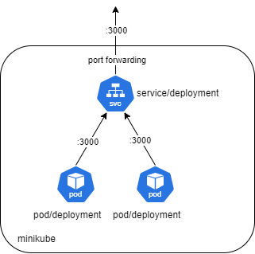

University: [ITMO University](https://itmo.ru/ru/)
Faculty: [FICT](https://fict.itmo.ru)
Course: [Introduction to distributed technologies](https://github.com/itmo-ict-faculty/introduction-to-distributed-technologies)
Year: 2024/2025
Group: K4110c
Author: Zagvozkin Artem Pavlovich
Lab: Lab2
Date of create: 08.12.2024
Date of finished: 19.12.2024


# Ход работы
### 1. Скачивание образа ifilyaninitmo/itdt-contained-frontend:master
```bash
docker pull ifilyaninitmo/itdt-contained-frontend:master
```


```bash
docker images
```


```bash
docker images
```


### 2. Запуск контейнера
```bash
docker run -d --name frontend-container ifilyaninitmo/itdt-contained-frontend:master
```


Проверка наличия
```bash
docker ps -a
```


### 3. Создание манифеста "lab2_pod.yaml"
```yaml
apiVersion: apps/v1
kind: Deployment
metadata:
  name: lab2_deployment
spec:
  replicas: 2
  selector:
    matchLabels:
      app: lab2_deployment
    template:
      metadata:
        labels:
          app: lab2_deployment
      spec:
        containers:
          - name: deployment
          image: ifilyaninitmo/itdt-contained-frontend:master
          ports:
            - containerPort: 3000
          env:
            - name: REACT_APP_USERNAME
              value: Artem Zagvozkin
            - name: REACT_APP_COMPANY_NAME
              value: Artzagvozkin Studio
```
В параметре replicas указано количество создаваемых реплик
В разделе env указаны переменные окружения требуемые для разворачиваемого приложения.

### 4. Создание развертывания
```bash
minikube kubectl -- apply -f lab2_deployment.yaml
```


Проверка
```bash
minikube kubectl get deployments
```


### 5. Создания сервиса LoadBalancer для доступа к развертыванию
```bash
minikube kubectl -- expose deployment lab2-deployment --port=3000 --target-port=3000 --name=deployment-service --type=LoadBalancer
```


### 6. Проброс портов
```bash
minikube kubectl -- port-forward service/deployment-service 3000:3000
```


### 7. Результат перехода по ссылке http://localhost:3000


### 8. Схема организации контейнеров

