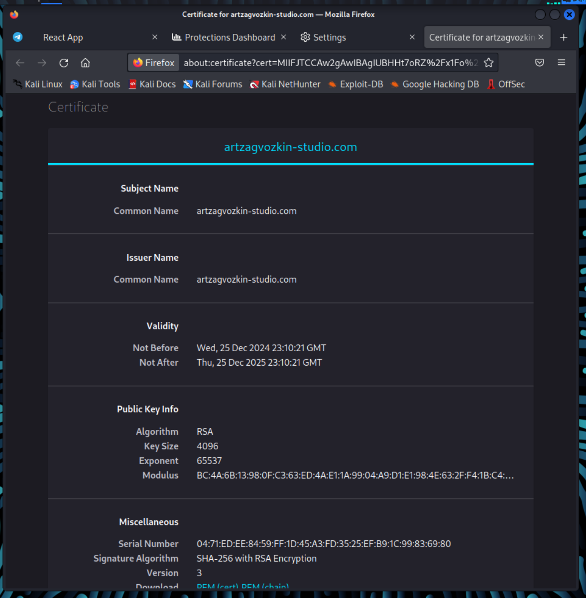

University: [ITMO University](https://itmo.ru/ru/)
Faculty: [FICT](https://fict.itmo.ru)
Course: [Introduction to distributed technologies](https://github.com/itmo-ict-faculty/introduction-to-distributed-technologies)
Year: 2024/2025
Group: K4110c
Author: Zagvozkin Artem Pavlovich
Lab: Lab3
Date of create: 20.12.2024
Date of finished: 21.12.2024


## Теория
ConfigMap - объект API, который позволяет хранить неконфиденциальные данные в формате ключ:значение. Используется для передачи данных в поды.

ReplicaSet - сервис, гарантирующий работу некоторого числа идентичных подов в любой момент своей работы.

Ingress - механизм, позволяющий определять порядок доступа к сервисам внутри кластера из внешнего окружения, причем доступ может осуществляться с помощью протоколов HTTP и HTTPS.

Egress — исходящий трафик из кластера, выходящий за пределы Kubernetes. Обычно регулируется с помощью политики egress.

TLS - протокол для обеспечения приватности и безопасности обмена данными. Протокол HTTPS является реализацией протокола TLS поверх HTTP. Часто реализуется с помощью сертификатов подлинности ресурса, или же TLS-сертификатов, устанавливаемых на сервер.

SSL-сертификат — это файл, который устанавливается на сервере с сайтом. Содержит цифровую подпись издателя, открытый ключ и имя владельца сертификата, название центра сертификации. Необходим для обеспечения безопасности пользовательских данных, подтверждения права собственности на веб-сайт, предотвращения создания поддельных версий сайта.

ClusterIP — сервис, который создаёт виртуальный IP-адрес внутри кластера Kubernetes, на который могут направляться запросы из других подов в этом же кластере. Сервис доступен только внутри кластера и не имеет публичного доступа извне. Является основным способом взаимодействия между компонентами внутри кластера, когда внешний доступ не требуется.


## Ход работы
### 1. Формирование манифеста для сервиса ConfigMap
В манифесете сервиса ConfigMap задаются значения для переменных среды: REACT_APP_USERNAME и REACT_APP_COMPANY_NAME.
```yaml
apiVersion: v1
kind: ConfigMap
metadata:
  name: lab3-configmap
data:
  react_app_user_name: "Artem Zagvozkin"
  react_app_company_name: "ArtZagvozkin Studio"
```

### 2. Формирование манифеста для контроллера ReplicaSet
```yaml
apiVersion: apps/v1
kind: ReplicaSet
metadata:
  name: lab3-replicaset
spec:
  replicas: 2
  selector:
    matchLabels:
      app: lab3-replicaset
  template:
    metadata:
      labels:
        app: lab3-replicaset
    spec:
      containers:
      - name: frontend
        image:  ifilyaninitmo/itdt-contained-frontend:master
        envFrom:
          - configMapRef:
              name: lab3-configmap
        ports:
        - containerPort: 3000
```

### 3. Применим манифесты ConfigMap и ReplicaSet
```bash
minikube kubectl -- apply -f lab3_configmap.yaml
```


```bash
minikube kubectl -- apply -f lab3_deployment.yaml
```


Проверяем
```bash
minikube kubectl get rs
```


### 4. Включение Ingress
Ingress - это объект Kubernetes, который управляет внешним доступом к сервисам внутри кластера. Позволяет направлять HTTPS-запросы к нужным сервисам на основе правил.
Включаем Ingress
```bash
minikube addons enable ingress
```


### 5. Создание TLS-сертификата
Создаем TLS-сертификат на 365 дней
```bash
openssl req -new -newkey rsa:4096 -x509 -sha256 -days 365 -nodes -out lab3.crt -keyout lab3.key
```


Импортируем сертификат
```bash
minikube kubectl -- create secret tls lab3-tls --key lab3.key --cert lab3.crt
```


### 6. Формирование манифеста для объекта Ingress
Запускаем сервис
```bash
minikube kubectl -- expose replicaset lab3-replicaset --port=3000 --name=lab3-service --type=ClusterIP
```

```yaml
apiVersion: networking.k8s.io/v1
kind: Ingress
metadata:
  name: lab3-ingress
spec:
  tls:
  - hosts:
    - artzagvozkin-studio.com
    secretName: lab3-tls
  rules:
  - host: artzagvozkin-studio.com
    http:
      paths:
      - path: /
        pathType: Prefix
        backend:
          service:
            name: lab3-service
            port:
              number: 3000
```

Применим данную конфигурацию
```bash
minikube kubectl -- apply 
```


### 7. Настройка /etc/hosts


### 8. Проверка


TLS-сертификат



### 9. Схема контейнеров


