University: [ITMO University](https://itmo.ru/ru/)
Faculty: [FICT](https://fict.itmo.ru)
Course: [Introduction to distributed technologies](https://github.com/itmo-ict-faculty/introduction-to-distributed-technologies)
Year: 2024/2025
Group: K4110c
Author: Zagvozkin Artem Pavlovich
Lab: Lab4
Date of create: 20.12.2024
Date of finished: 26.12.2024


## Теория
CNI (Container Network Interface) — спецификация, предназначенная для управления сетевыми интерфейсами в контейнеризованных средах - например, Kubernetes. CNI определяет набор API и протоколов, которые позволяют контейнерам устанавливать и управлять сетевыми соединениями.

Calico - сетевой плагин для Kubernetes, который обеспечивает сетевую политику и сетевую безопасность для контейнеризированных приложений. У него есть следующие возможности:
 - Поддержка сетевых политик;
 - IP-адресация;
 - Интеграция с другими сервисами для организации сетевого взаимодействия.

CoreDNS - DNS-сервер, позволяющий принимать запросы по UDP/TCP, TLS и gRPC. В рамках Kubernetes используется в виде аддона для обнаружения деталей окружения, чтобы новые экземпляры приложения могли подключаться к существующему окружению без ручного вмешательства.

IPAM - сервис для управления IP-адресами, используется Kubernetes для выделения первых подам. CNI Calico предоставляет собственный IPAM-сервис – calico-ipam.

IPPool - ресурс, направленный на определение наборов IP-адресов для сетевых интерфейсов контейнеров. Функция IPAM позволяет автоматизировать выделение, резервирование и управление IP-адресами для Podов в Kubernetes.

## Ход работы
### 1. Запуск minikube
```bash
minikube start --memory=3512 --cpus=2 --network-plugin=cni --cni=calico --nodes 2
```
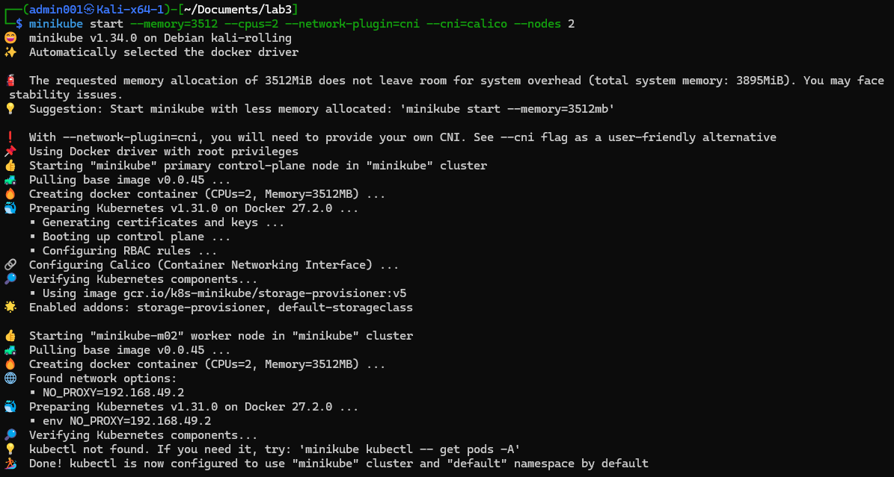

Проверяем
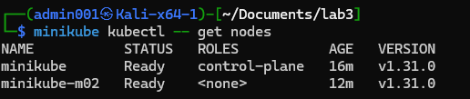
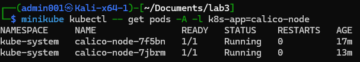
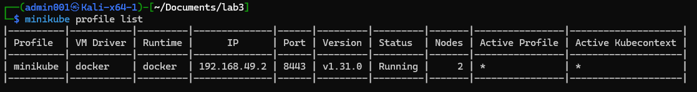


### 2. Настройка Calico
Маркировка нод
```bash
minikube kubectl -- label nodes minikube zone=west
minikube kubectl -- label nodes minikube-m02 zone=east
```
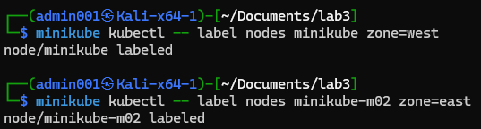

Удалим стандартный пул
```bash
minikube kubectl delete ippools default-ipv4-ippool
```
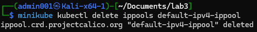

Манифест для пулов ip-адресов
```yaml
apiVersion: crd.projectcalico.org/v1
kind: IPPool
metadata:
  name: zone-west-ippool
spec:
  cidr: 192.168.0.0/24
  ipipMode: Always
  natOutgoing: true
  nodeSelector: zone == "west"

---
apiVersion: crd.projectcalico.org/v1
kind: IPPool
metadata:
  name: zone-east-ippool
spec:
  cidr: 192.168.1.0/24
  ipipMode: Always
  natOutgoing: true
  nodeSelector: zone == "east"
```

Добавим пулы из манифеста
```bash
minikube kubectl -- apply -n kube-system -f ipools.yaml
```
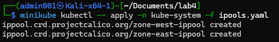

Проверим пулы в неймспейсе
```bash
minikube kubectl -- get ippools -n kube-system
```
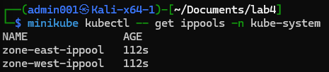


### 3. Создание Deployments и сервиса, проброс портов
Манифест деполоя
```yaml
apiVersion: apps/v1
kind: Deployment
metadata:
  name: lab4-deployment
spec:
  replicas: 2
  selector:
    matchLabels:
      app: lab4-deployment
  template:
    metadata:
      labels:
        app: lab4-deployment
    spec:
      containers:
        - name: frontend
          image: ifilyaninitmo/itdt--frontend:master
          ports:
          - containerPort: 3000
          env:
            - name: REACT_APP_USERNAME
              value: "Artem Zagvozkin"
            - name: REACT_APP_COMPANY_NAME
              value: "ArtZagvozkin Studio"
```

Применим конфигурацию
```bash
minikube kubectl -- apply -f deployments.yaml
```
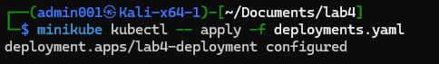

Создадим сервис
```bash
minikube kubectl -- expose deployment lab4-deployment --port=3000 --name=lab4-service --type=ClusterIP
```
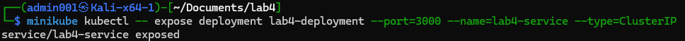


Проброс портов
```bash
minikube kubectl -- port-forward service/lab4-service 3000:3000
```
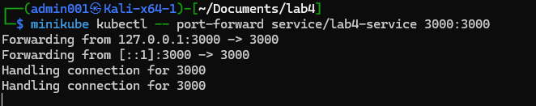


### 4. Проверка работы
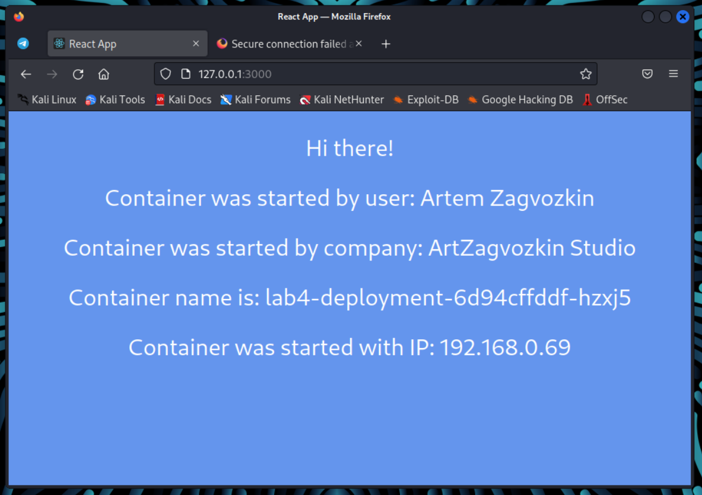

Узнаем ip-адреса подов
```bash
kubectl -- get pods -o wide
```
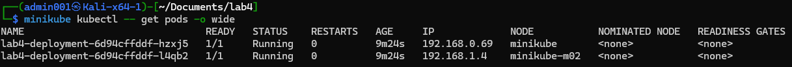


Подключимся к первому поду и попробуем попинговать
```bash
minikube kubectl -- exec -ti lab4-deployment-6d94cffddf-hzxj5 -- sh
ping 192.168.0.69
```
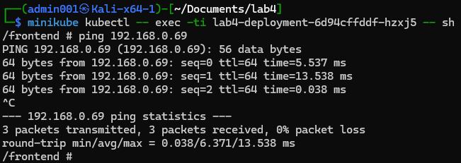


Подключимся ко второму поду и попробуем попинговать
```bash
minikube kubectl -- exec -ti lab4-deployment-6d94cffddf-l4qb2 -- sh
ping 192.168.1.4
```
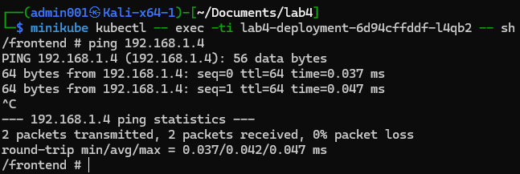

### 5. Схема организации
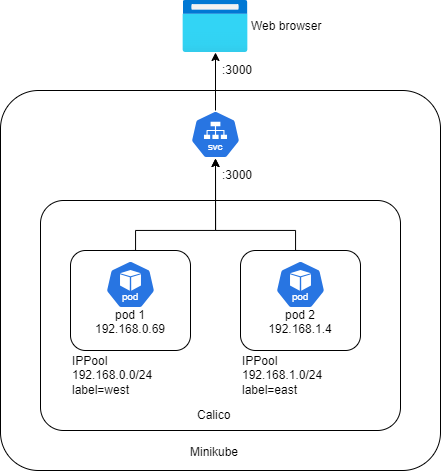

